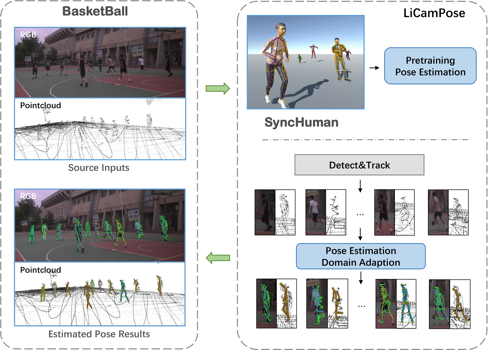
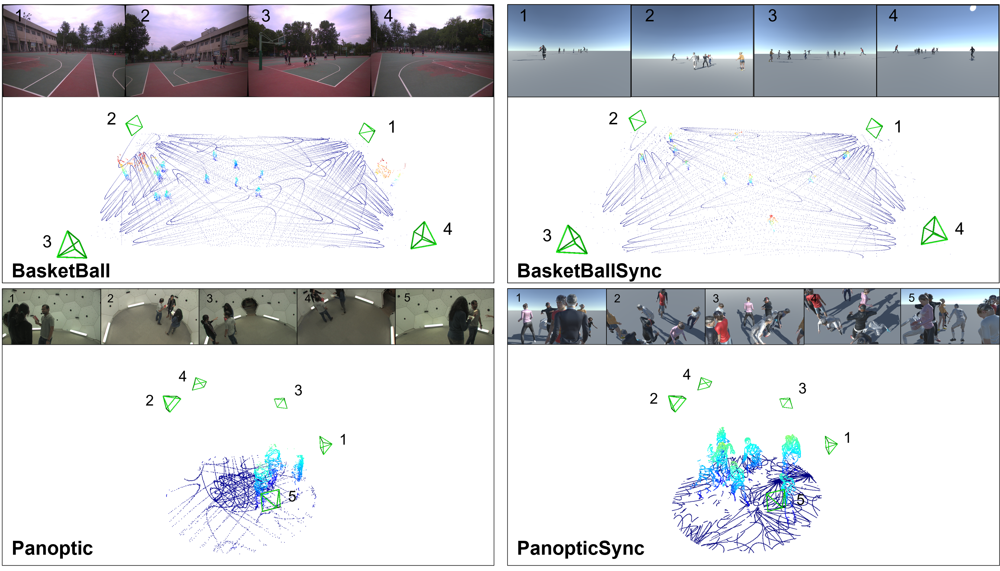

<p align="center">
  <h1 align="center">LiCamPose: Combining Multi-View LiDAR and RGB Cameras for Robust Single-timestamp 3D Human Pose Estimation</h1>
  <p align="center">
    <strong>Zhiyu Pan, Zhicheng Zhong, Wenxuan Guo, Yifan Chen, Jianjiang Feng, Jie Zhou</strong> <br>
    Department of Automation, Tsinghua University, China <br>
  </p>
  <div align="center">
    <div style="display: inline-block; margin: 10px;">
      
      <p><strong>Pipeline</strong></p>
    </div>
    <div style="display: inline-block; margin: 10px;">
      
      <p><strong>Datasets</strong></p>
    </div>
  </div>
</p>

---

## 🧠 Overview

This repository provides the official implementation of **LiCamPose**, a pipeline for estimating 3D human poses from multi-view RGB and LiDAR inputs captured at a single timestamp.  
LiCamPose establishes a strong baseline for 3D human pose estimation by fusing dense spatial and geometric information from cameras and point clouds.  
The project also includes a synthetic data generator (SyncHuman) and real-world datasets for training and evaluation.

> 📄 This work has been accepted at **WACV 2025**.

---

## 🔧 Requirements

We recommend the following setup:

- **GPU**: NVIDIA RTX 3090 or higher
- **System**: Ubuntu 20.04.4+ for model training; Windows 10+ for running SyncHuman
- **Unity Version**: 2021.3.7f1c1 (for SyncHuman)

Install dependencies:

```bash
pip install -r requirements.txt
````

---

## 📦 Dataset Downloads

* **[BasketBall Dataset (real-world)](https://cloud.tsinghua.edu.cn/d/06241a11447049d9b6da/)**
* **[BasketBallSync Dataset (synthetic)](https://cloud.tsinghua.edu.cn/d/18d4f821ac764db6923a/)**

To extract the datasets, use the following commands to combine the split files and unzip the archive:
```bash
zip -s 0 BaseketBall.zip --out BaseketBall_merged.zip
unzip BaseketBall_merged.zip
```
---

## 📥 Download SyncHuman Generator

Download SyncHuman from [this link](https://cloud.tsinghua.edu.cn/f/cead8353ba2341a9a162/?dl=1).
Set the output path in the `Generate Point Cloud` script under the `Point Cloud Particle System` component.
Specify the pose file folder (e.g., CMU) in the `Frame Rate Controller` script of the `Runtime Parameters Controller`.

---

## 🏋️‍♂️ Training

Example: training on **BasketBallSync**:

```bash
python train_mul.py --cfg config/BasketBallSync.yaml
```

---

## 🧪 Evaluation

Example: evaluation on **Panoptic Studio**:

```bash
python validate_pan_mul.py --cfg config/panoptic.yaml
```

---

## 📁 Dataset Structure

Please organize the datasets as follows:

<details>
<summary><strong>BasketBall</strong> (real-world)</summary>

```bash
BasketBall/
├── images/
│   ├── camera_timecode.csv
│   └── camera/
│       ├── camera_1/
│       ├── camera_2/
│       ├── camera_3/
│       └── camera_4/
├── points_pcd_roi/
├── points_ped/
├── pose_2d_ped/
```

</details>

<details>
<summary><strong>BasketBallSync</strong> (synthetic)</summary>

```bash
BasketBallSync/
├── images/
│   ├── 1/ 2/ 3/ 4/              # View folders
│   └── camera_*.txt            # Calibration files
├── joints/                     # 3D ground truth
├── points/                     # Scene-level point clouds
├── points_ped/                 # Player-level point clouds
└── pred_2d_folder/             # ViTPose-predicted 2D joints
```

</details>

---

## ⚠️ License and Usage

The code related to DMD is released under the MIT License.
**This project is intended for academic research only. Commercial use is strictly prohibited.**

---

## 📖 Citation

If you find this project useful, please consider citing:

```bibtex
@INPROCEEDINGS{10943637,
  author    = {Pan, Zhiyu and Zhong, Zhicheng and Guo, Wenxuan and Chen, Yifan and Feng, Jianjiang and Zhou, Jie},
  booktitle = {2025 IEEE/CVF Winter Conference on Applications of Computer Vision (WACV)}, 
  title     = {LiCamPose: Combining Multi-View LiDAR and RGB Cameras for Robust Single-timestamp 3D Human Pose Estimation}, 
  year      = {2025},
  pages     = {2484-2494},
  doi       = {10.1109/WACV61041.2025.00247}
}
```

---

## 🌟 Acknowledgement

Thanks to all contributors and dataset providers. Please reach out if you encounter any issues or have questions.

---
