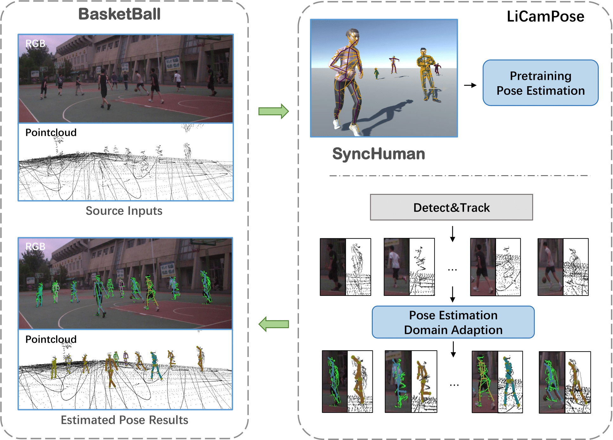
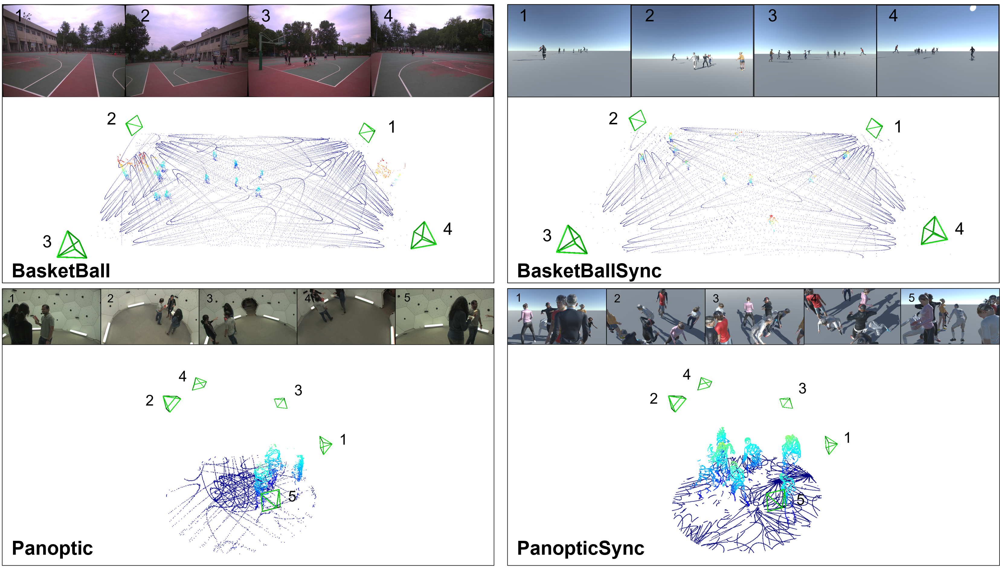

<p align="center">
  <h1 align="center">LiCamPose: Combining Multi-View LiDAR and RGB Cameras for Robust Single-timestamp 3D Human Pose Estimation</h1>
  <p align="center">
    <strong>Zhiyu Pan, Zhicheng Zhong, Wenxuan Guo, Yifan Chen, Jianjiang Feng, Jie Zhou</strong></a>
  </p>
  <div align="center">
    <div style="display: inline-block; margin: 10px;">
      
      <p><strong>Pipeline</strong></p>
    </div>
    <div style="display: inline-block; margin: 10px;">
      
      <p><strong>Datasets</strong></p>
    </div>
  </div>
  <br>
</p>

## Overview
This Repo contains the implementation codes, SyncHuman generator, and BasketBall datasets described in the paper to estimated the 3D human pose by fusion the RGB and LiDAR informations from multiple views in single timestamp. LiCamPose aims to establish a baseline for 3D human pose estimation using multi-view RGB and LiDAR data, while also offering a dataset generator to facilitate further research in the field. This paper is accepted by WACV 2025.

## News and Update
* [Sep. 1st] Basic Version Release.
    * The basic training code of LiCamPose.
    * A few examples of BasketBallSync and BasketBall
    * SyncHuman Generator
* [TODO] ★
    * Complete Datasets Release.
    * Generator with more functions Release.
    * Stay tuned.

## Requirements
We recommend running our code on an Nvidia GPU equivalent to or better than the 3090, with a Linux Ubuntu system version 20.04.4 or higher. For running the SyncHuman Generator, we suggest using Windows 10 or later, with Unity version 2021.3.7f1c1.

Basic requirements about codes:
```
pip install -r requirement.txt
```

## Download SyncHuman
Download the SyncHuman from the [link](https://cloud.tsinghua.edu.cn/f/cead8353ba2341a9a162/?dl=1). The saving path can be set at the `Generate Point Cloud` script from the `Point Cloud Particle System` Component. The folder of pose files (`CMU`) can be set at the `Frame Rate Controller` script from the `Runtime Parameters Controller` Component. We plan to develop a more user-friendly interface for SyncHuman.


## Training 
Take training on BasketBallSyc as example:
```
python train_mul.py --cfg config/BasketBallSync.yaml
```

## Evaluating:
Take evaluating on Panoptic Studio as exaple:
```
python validate_pan_mul.py --cfg config/panoptic.yaml
```

## Prepare the Datasets
Place the BasketBall and BasketBallSync dataset in the structure as follows:
```bash
BasketBall/
├── images/  # RGB images 
│   ├── camera_timecode.csv
│   └── camera # images from four views
│       ├── camera_1
│       ├── camera_2
│       ├── camera_2
│       └── camera_3
│           ├── 00000.jpeg
│           ├── 00001.jpeg
│           └── ...
├── points_pcd_roi/ # point cloud 
│   ├── 00000.pcd
│   ├── 00001.pcd
│   └── ...  
├── points_ped/ # point cloud for each player
│    ├── 000000_001.ply # <frame_id>_<player_id>.ply
│    ├── 000000_002.ply
│    └── ...
└── pose_2d_ped/ # predicted 2D poses for each player
    ├── camera_1
    ├── camera_2
    ├── camera_2
    └── camera_3
        ├── 000000_001.json # <frame_id>_<player_id>.json
        ├── 000000_002.json
        └── ...

BasketBallSync/
├── images/  # RGB images 
│    ├── 1 # view 1
│        ├── camera_0.jpg # camera_<frame_id>.jpg
│        ├── camera_1.jpg
│        └── ...
│    ├── 2
│    ├── 3
│    ├── 4
│    ├── camera_1.txt # calibration parameters
│    ├── camera_2.txt
│    ├── camera_3.txt
│    └── camera_4.txt
├── joints/ # ground truth 3D joints
│    ├── 0 # player ID
│    ├── ...
│    └── 9
│        ├── joints_0.txt # joints_<frame_id>.txt
│        └── ...
├── points/ # point cloud of the scene
│    ├── point_0.txt # point_<frame_id>.txt
│    └── ...
├── points_ped/ # point cloud of each player
│    ├── 0 # player ID
│    ├── ...
│    └── 9
│        ├── 00000.ply # <frame_id>.ply
│        ├── 00001.ply
│        └── ...
└── pred_2d_folder # 2D joints label predicted by VitPose of each player
    ├── 0 # player ID
    ├── ...
    └── 9
        ├── 1 # view_id
        ├── 2
        ├── 3
        └── 4
            ├── 00000.json # <frame_id>.json
            └── ...
```

## License and Usage Restrictions
Code related to the DMD is under MIT license. \
**! ! This project is intended for academic research purposes only and cannot be used for commercial purposes.**

## Citation
If you find our repo helpful, please consider leaving a star or cite our paper :)

```
@article{LiCamPose,
  title={LiCamPose: Combining Multi-View LiDAR and RGB Cameras for Robust Single-frame 3D Human Pose Estimation},
  author={Pan, Zhiyu and Zhong, Zhicheng and Guo, Wenxuan and Chen, Yifan and Feng, Jianjiang and Zhou, Jie},
  journal={arXiv preprint arXiv:2312.06409},
  year={2023}
}
```